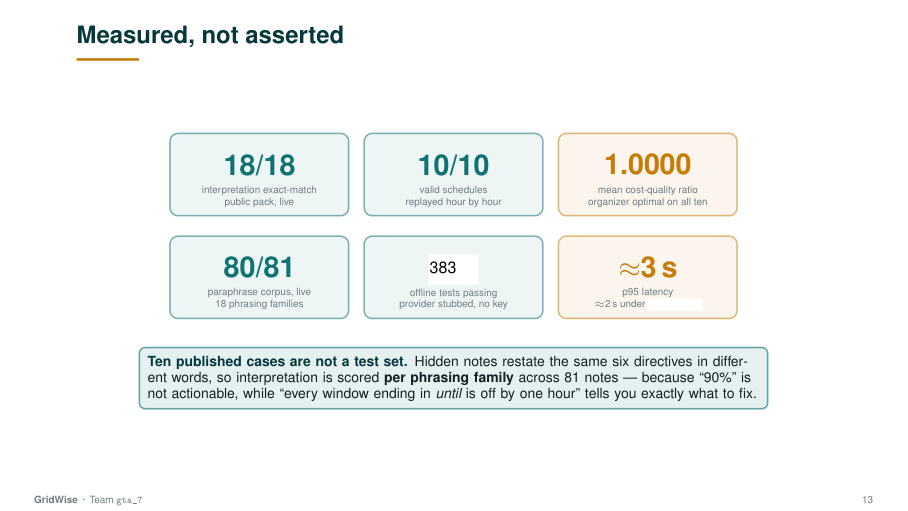
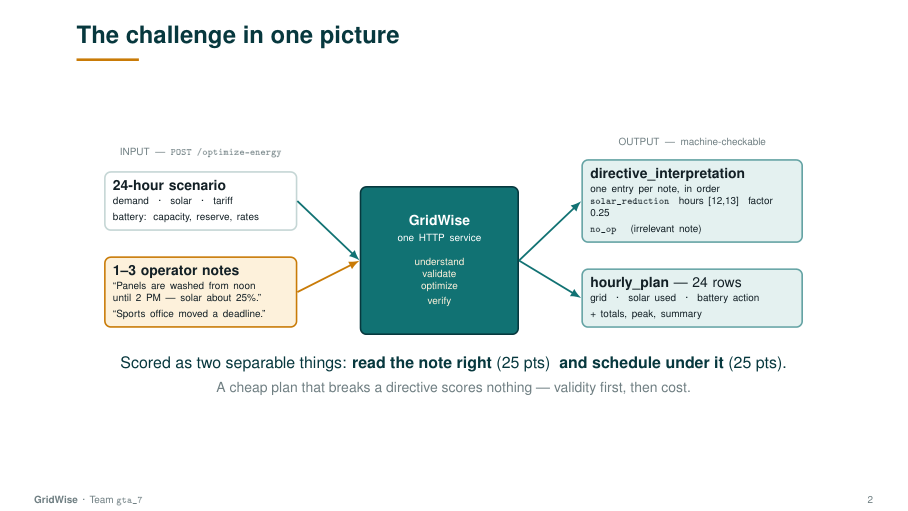
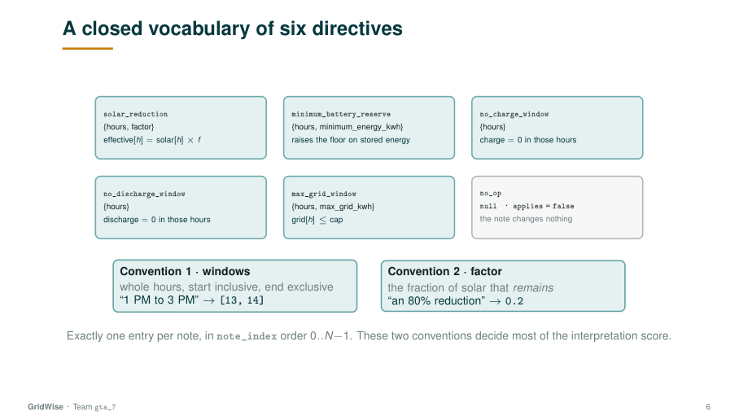
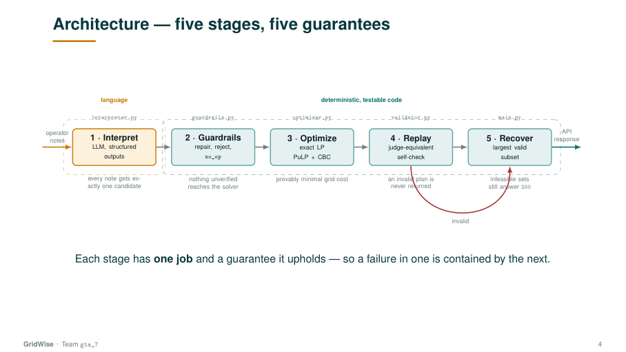
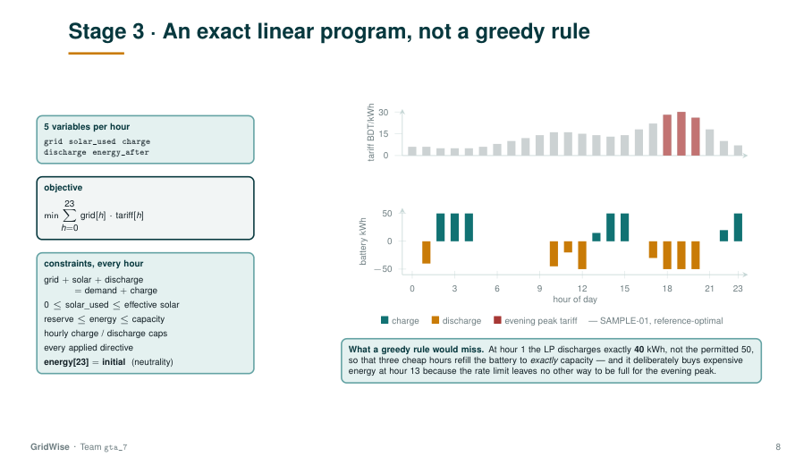

# GridWise — LLM-Assisted Campus Energy Optimizer

BUP CSE Fest 2026 Hackathon · Online Preliminary · Smart Campus Energy Optimization Challenge

**Team gta_7** · Ishmam Tahmid · Farhan Tahsin Khan · Mahmudul Hasan · Kazi Badrul Hasan

**Understand → Validate → Optimize → Verify.** The LLM handles language · guardrails handle
trust · the LP handles the maths · the replay handles proof.

A single HTTP service that reads free-text campus-operator notes with a language model,
validates the extracted directives deterministically, applies them to a 24-hour energy
scheduling problem, and returns a provably valid minimum-cost plan.

```
operator notes ──▶ LLM interpretation ──▶ deterministic guardrails ──▶ LP optimizer ──▶ replay self-check ──▶ response
   (free text)      OpenAI, structured      repair / reject / no_op     exact CBC solve    judge-equivalent,
                    JSON schema output                                                     and it can veto
```

**Deployed endpoint** — `https://gridwise-api-gta-7.onrender.com`

```bash
curl -s https://gridwise-api-gta-7.onrender.com/health
# {"status":"ok"}
```

No login, VPN or manual approval is needed to reach it.

**Current measured state**

| | |
|---|---|
| Public pack, live | 18/18 interpretation · 10/10 valid · cost ratio **1.0000** |
| Paraphrase corpus, live | **81/81** across 18 phrasing families |
| Offline test suite | **383 passing** (1 skipped) across 15 adversarial categories |
| Latency | p95 ≈ **2.4 s**, ≈ 2 s under 10-way concurrency |



---

## Quick reference card

The 12 items the rubric checks for "self-contained, runnable from a fresh
environment". Every value is exact; every command is copy-paste.

| Rubric item | Value |
|---|---|
| **Setup** | `git clone https://github.com/ishmam259/gta_7.git && cd gta_7` |
| **Required env-var names** | `OPENAI_API_KEY`, `OPENAI_MODEL`, `OPENAI_TIMEOUT_SECONDS`, `OPENAI_MAX_RETRIES`, `INTERPRETER_DEADLINE_SECONDS`, `PORT`, `LOG_LEVEL` — see [Configuration](#configuration) |
| **Model / provider** | OpenAI `gpt-5.1` (default); override via `OPENAI_MODEL`. Reasoning-class models retry once without `temperature=0` — see `_create_with_temperature_fallback` |
| **LLM role** | Mandatory interpretation path for `operator_notes` — the only component that turns free text into a structured `directive_interpretation` entry |
| **Guardrails** | `app/guardrails.py` — deterministic repair/reject/`no_op` of every LLM-emitted directive before it reaches the optimizer |
| **Optimizer / solver** | `app/optimizer.py` — PuLP + CBC exact LP solve over the 24-hour schedule |
| **Dependencies** | FastAPI · Uvicorn · Pydantic · PuLP · CBC (system binary) · openai · python-dotenv · pytest · httpx — pinned in `requirements.txt` |
| **Exact run command** | `uvicorn app.main:app --host 0.0.0.0 --port 8000` (or `docker run … ishmam259/gridwise-api:v1`) |
| **`/health` test** | `curl -s http://127.0.0.1:8000/health` → `{"status":"ok"}` (live: `https://gridwise-api-gta-7.onrender.com/health`) |
| **`/optimize-energy` curl/sample** | `curl -s -X POST http://127.0.0.1:8000/optimize-energy -H 'Content-Type: application/json' -d @samples/example_request.json` |
| **Known limitations** | [Known limitations](#known-limitations) — one-directive-per-note, "through" reads inclusive, weak on non-contiguous hour lists, no modelling of battery round-trip efficiency |
| **No committed secrets** | `.gitignore` excludes `.env`; `.env.example` ships placeholders only; the Docker image contains no credentials; controlled `500` responses never echo prompts or env values |
| **Public-sample test command** | `python scripts/smoke_test.py` (local) or `python scripts/smoke_test.py https://gridwise-api-gta-7.onrender.com` (live) — see [Running the checks](#running-the-checks); expected output: `Mean cost-quality ratio : 1.0000  ->  10.00/10` |
| **Sample request / response** | `samples/example_request.json` (request) + abbreviated response shape in [API contract](#api-contract) — see [Sample request / response](#sample-request--response) below |
| **External tools & credits** | FastAPI · Pydantic · PuLP · CBC · OpenAI SDK · pytest · httpx · python-dotenv + AI coding assistant — see [External tools & credits](#external-tools--credits) |
| **Deployment test command** | `python scripts/smoke_test.py https://gridwise-api-gta-7.onrender.com` — see [Test the deployment](#test-the-deployment-30-second-probe-no-api-key); or single-test variant: `BASE_URL=https://gridwise-api-gta-7.onrender.com pytest -q tests/test_public_cases.py` |

For the full env-var table, run commands, and Docker path, see [Configuration](#configuration),
[Deployment](#deployment), and [Security](#security).

---

## Deliverables

Required items from Participant Guide § 02 and where each one lives in this submission.

| Required item (rubric) | Where it lives |
|---|---|
| **API service** — one HTTP service exposing both required endpoints | `app/main.py` |
| **`GET /health`** — readiness response for the judging harness | `app/main.py` (`/health` route) |
| **`POST /optimize-energy`** — main LLM interpretation + 24-hour optimization endpoint | `app/main.py` (`/optimize-energy` route) |
| **`directive_interpretation`** — exactly one machine-checkable entry per operator note, in `note_index` order | `app/interpreter.py`, `app/guardrails.py` |
| **`hourly_plan`** — the final 24-hour schedule after applying all valid directives | `app/optimizer.py`, `app/validator.py` |
| **Source repository** — full source code + dependency/configuration files | this repository |
| **README.md** — excellent, self-contained, lets organizers run/test without team assistance | this file |
| **Docker fallback image** — tested container as fallback execution path | `Dockerfile`, image `ishmam259/gridwise-api:v1` |
| **3-minute solution video** — explains problem, architecture, key implementation choices | uploaded separately |

## Submission package

Required submission items from Participant Guide § 02 and where each one lives.

| # | Required submission | Where it lives |
|---|---|---|
| 1 | **Working public endpoint** — base URL the judge can `GET /health` and `POST /optimize-energy` against | `https://gridwise-api-gta-7.onrender.com` (kept warm by `.github/workflows/keep-warm.yml` and `scripts/keep_warm.py`) |
| 2 | **GitHub repository** — repo created after question reveal, kept private during the event, public after the submission deadline | this URL |
| 3 | **README & configuration** — setup/run, model/provider, env-var names, solver/library, sample requests/responses | this README, [Quickstart](#quickstart), [Configuration](#configuration), [API contract](#api-contract) |
| 4 | **Docker fallback image** (Public API URL recommended) — pullable registry reference with exact tag/digest, env-var names, exposed port, documented `docker run` command | `Dockerfile`, image `ishmam259/gridwise-api:v1` |
| 5 | **3-minute architecture / solution video** | uploaded separately |

## Testing & Submission Checklist

Run-list from Participant Guide § 05 and where each check is verified in this repo.

| Check | Where it lives |
|---|---|
| **API** — `/health` responds; `/optimize-energy` accepts the exact request schema and returns the exact response schema | `scripts/smoke_test.py` |
| **LLM interpretation** — every operator note produces exactly one `directive_interpretation` entry in `note_index` order with `applies`, `directive_type`, `structured_adjustment`, and `explanation` | `scripts/smoke_test.py`, `scripts/paraphrase_bench.py` |
| **Guardrails & directives** — only supported directive types emitted; `no_op` uses `applies = false`, `null` adjustment; others use `applies = true`; hours are unique integers 0–23 ascending; numeric values valid; relevant directives applied before optimization | `tests/test_guardrail_fuzz.py`, `tests/test_window_expansion.py`, `tests/test_api.py` |
| **Optimization** — the 24-hour plan is valid first, then minimises recalculated grid electricity cost after all organizer-ground-truth directives are applied | `scripts/smoke_test.py`, `app/optimizer.py` |
| **Energy constraints** — demand, effective solar, battery bounds, rate limits, state transitions, directive-specific limits, and end-of-day neutrality all respected | `app/validator.py`, `app/main.py` |
| **Robustness** — malformed JSON, invalid structured input, LLM/provider errors, repeated requests, and unexpected valid numeric combinations do not crash the service | `tests/test_adversarial.py` |
| **Deployment** — both endpoints work from outside the development environment and remain reachable during evaluation | `render.yaml`, `Dockerfile`, `.github/workflows/keep-warm.yml` |
| **Submission** — endpoint, public-after-deadline repo, excellent README/local quickstart, model/provider, env-var names, optimizer/solver, cited libraries, sample request/response, fallback Docker image, and 3-minute video all included | this README, `Dockerfile`, uploaded video |
| **Local reproduction** — from a clean machine, follow the README and verify `/health` returns `{"status":"ok"}` and at least one Public Sample Case succeeds without undocumented steps | [Quickstart](#quickstart), [Running the checks](#running-the-checks) |
| **3-minute video** — accessible to judges, ≤3 min, explains the problem, architecture, solution approach, LLM/guardrail/optimizer flow, and how the system is executed/tested | uploaded separately |

## Optimization quality

The scoring formula from the rubric, applied verbatim:

```
quality_ratio   = min(1, organizer_optimal_cost / recalculated_team_cost)
optimization_score = 10 × mean(quality_ratio across all optimization hidden cases)
```

**Invalid cases score zero.** A hidden case only counts toward `optimization_score`
*after* the judge confirms:
1. the structured `directive_interpretation` matches the organizer's ground truth
   (`relevance`, `directive_type`, affected `hours`, and required numeric values), **and**
2. the returned `hourly_plan` obeys every directive that *would have applied* under that
   ground truth (replayed independently by the judge, not only by the team's reporter).

A cheap plan built on a wrong or ignored directive scores **zero**, not "close".

Cost and quality axes, and where each one is verified in this submission:

| Cost-quality axis | Where it is verified |
|---|---|
| Organizer-optimal reached | `scripts/smoke_test.py` |
| Mean `quality_ratio` | `scripts/smoke_test.py` |
| Invalid cases (plan breaks a directive) | `scripts/smoke_test.py`, `app/main.py` (`_solve_best_effort`) |
| Recalculation source of truth | `app/optimizer.py`, `app/main.py` (totals derived from `hourly_plan`) |

## Scoring rubric (7 categories · 100 pts)

The seven scoring categories the harness computes (Participant Guide § 07), with
the point weights and what the harness measures for each.

| # | Category | Points | What the harness measures |
|---|---|---:|---|
| 1 | **LLM Directive Interpretation** | **25** | `5 relevance/no_op + 5 directive_type + 5 affected hours + 5 numeric values/required structured_adjustment shape + 5 paraphrase robustness` |
| 2 | **Directive Application & Constraint Correctness** | **25** | `10 organizer-ground-truth directive application + 5 hourly energy balance/effective-solar validity + 5 battery transitions/bounds/rate limits + 5 action consistency/end-of-day neutrality/non-negative values` |
| 3 | **Optimization Quality** | **10** | `min(1, organizer_optimal_cost / recalculated_team_cost)` averaged across valid hidden cases (invalid cases score 0) |
| 4 | **API Contract & Schema** | **10** | `2 endpoints/status behaviour + 2 request validation + 3 directive_interpretation schema/order/types + 3 hourly_plan/top-level response schema and scenario_id echo` |
| 5 | **Performance & Reliability** | **10** | `2 health readiness + 3 p95 latency + 3 valid-request stability/failure rate + 2 controlled malformed/model-provider failure handling and secret safety` |
| 6 | **Deployment & Docker Fallback** | **10** | `3 live endpoint reachability + 4 working pullable Docker fallback image that reaches /health using the documented command + 2 clean startup/reproducibility from submitted instructions + 1 no judge debugging/manual code changes required` |
| 7 | **Documentation & Local Reproducibility** | **10** | `3 clean local quickstart from a fresh environment + 2 environment/configuration/model-provider documentation + 2 public-sample test procedure and expected result + 1 LLM/guardrail/optimizer architecture explanation + 1 Docker pull/run fallback instructions + 1 dependencies, limitations, and secret-handling guidance` |
| | **TOTAL** | **100** | |

**Scoring principle (from the rubric):** the system is judged as a pipeline —
*understand the note, validate the structured directive, apply it to the optimization,
return a valid schedule, and then optimize cost.* A cheap schedule built on a wrong
or ignored directive scores zero.

## LLM & API quality metrics

These are the machine-checkable thresholds the judge harness and reproducibility
checks apply (Participant Guide § 08). The **Expected standard** column is the
rubric wording; the **Where it is verified** column points at the artifact in this
submission that exercises it.

| Metric | Expected standard (rubric § 08) | Where it is verified |
|---|---|---|
| **Interpretation coverage** | Exactly one `directive_interpretation` entry for every `operator_notes` item, returned in `note_index` order `0..N-1`; missing / duplicate / out-of-order mappings are failures | `app/interpreter.py`, `app/guardrails.py`, `scripts/smoke_test.py` |
| **Directive accuracy** | `applies`, `directive_type`, `required_structured_adjustment` shape, hours, and numeric values must match organizer ground truth within tolerance; `no_op` uses `applies = false` + `null` adjustment | `tests/test_guardrail_fuzz.py`, `app/validator.py` |
| **Paraphrase robustness** | Equivalent hidden phrasings of the same rule must resolve to the same underlying directive; whole-hour time ranges are mandatory | `tests/paraphrase_cases.json`, `scripts/paraphrase_bench.py`, `app/guardrails.py` (`expand_window`) |
| **Downstream application** | The final `hourly_plan` must satisfy every applicable organizer-ground-truth directive (solar_reduction, minimum_battery_reserve, no_charge_window, no_discharge_window, max_grid_window) | `app/validator.py`, `app/optimizer.py`, `app/main.py` (`_solve_best_effort`) |
| **Health readiness** | `GET /health` returns `{"status":"ok"}` within 60 s of service start | `app/main.py` (`/health`), `render.yaml`, `Dockerfile` |
| **Per-request timeout** | `POST /optimize-energy` must complete within 30 s; longer responses are counted as failures | `app/main.py`, `app/interpreter.py` (`INTERPRETER_DEADLINE_SECONDS`) |
| **p95 latency** | `≤ 5 s → 3/3 latency points` · `> 5 to 15 s → 2/3` · `> 15 to 30 s → 1/3` · `> 30 s → 0/3` and treated as failure | `scripts/smoke_test.py`, `scripts/keep_warm.py`, `.github/workflows/keep-warm.yml` |
| **Failure rate** | Valid requests should not return 5xx, invalid JSON, or no response | `tests/test_adversarial.py`, `tests/test_api.py` |
| **Malformed input** | Return a controlled error or safe failure; do not crash or invent an unsupported directive | `app/main.py`, `app/guardrails.py`, `tests/test_api.py` |
| **Secret handling** | No API keys, tokens, raw secret values, or sensitive stack traces in repo, logs, or responses | `.gitignore`, `app/main.py`, `Dockerfile` |
| **Time & factor normalization** | Hours must be unique integers 0–23 in ascending order; whole-hour time ranges; for `solar_reduction`, an 80% reduction is `factor = 0.2` | `app/guardrails.py` (`expand_window`, factor repair) |
| **Numeric tolerance** | Absolute tolerance of `0.01 kWh` or `0.01 BDT` unless the judge package specifies a stricter value | `app/validator.py`, `app/main.py` (totals recomputed from `hourly_plan`) |
| **Documentation & local reproducibility** | Judges can reproduce the service from a clean environment using only the README + documented env-var names | [Quickstart](#quickstart), [Configuration](#configuration) |
| **Docker fallback image** | Image is pulled and started with the documented command; reaches `/health`; no baked-in credentials | `Dockerfile`, `render.yaml` |
| **3-minute video** | Accessible to judges, ≤ 3 min, explains problem / architecture overview / solution approach / LLM → deterministic guardrails → optimizer flow / how the run/test was performed | uploaded separately |

**Two rubric callouts restated explicitly**, because they decide how the scoring
penalty tier is assigned:

> *Hidden operator notes have organizer ground truth for relevance, directive type,
> affected hours, and required numeric values. Free-text explanation wording is
> **not** judged byte-for-byte.*

Only the structured fields matter for interpretation credit; `explanation` is human-facing
prose and may vary across runs of the same valid interpretation.

> *Ground truth before cost. The judge first checks the organizer ground-truth
> directive, its downstream application, and the normal GridWise constraints. Only
> then is optimization quality scored for that hidden case.*

A correct interpretation with an illegal plan still forfeits the case for Optimization
Quality. This is why stage 4 (replay self-check) is allowed to veto, not just log.

---

## Contents

- [Deliverables](#deliverables) · [Submission package](#submission-package)
- [Quick reference card](#quick-reference-card) — the 12 rubric checklist items at a glance
- [Testing & Submission Checklist](#testing--submission-checklist)
- [Optimization quality](#optimization-quality)
- [Scoring rubric (7 categories · 100 pts)](#scoring-rubric-7-categories--100-pts)
- [LLM & API quality metrics](#llm--api-quality-metrics)
- [Local Reproducibility](#local-reproducibility)
- [Quickstart](#quickstart) · [Running the checks](#running-the-checks)
- [Sample request / response](#sample-request--response)
- [Test the deployment (30-second probe, no API key)](#test-the-deployment-30-second-probe-no-api-key)
- [The problem in one page](#the-problem-in-one-page)
- [Architecture](#architecture) — the five stages and what each guarantees
- [Design decisions worth knowing](#design-decisions-worth-knowing) — and the bugs behind them
- [Testing](#testing) · [Configuration](#configuration) · [Deployment](#deployment)
- [API contract](#api-contract) · [Reliability](#reliability-and-safe-failure)
- [Repository layout](#repository-layout) · [Working on this](#working-on-this)
- [Dependencies](#dependencies) · [External tools & credits](#external-tools--credits)
- [Known limitations](#known-limitations) · [Security](#security)

---

## Local Reproducibility

Every check the rubric's reproducibility criteria ask for — *clone/pull, configure
environment-variable names, install or pull image, start service, call `/health`,
run at least one public sample against `/optimize-energy`* — is one short copy-paste
block below. The Public Sample Cases are worked input/output examples published by
the organizer for **local validation only**; they are references, not the hidden
judge set.

### A. Reproduce the service in 6 commands (no API key required for `/health`)

From a clean machine with Python 3.11+ and Docker (or just Python):

```bash
# 1. Clone
git clone https://github.com/ishmam259/gta_7.git && cd gta_7

# 2. Configure environment-variable names (.env.example documents every one)
cp .env.example .env                          # then edit .env and set OPENAI_API_KEY

# 3. Install (local Python path) — OR pull the published Docker image:
pip install -r requirements.txt
# docker pull ishmam259/gridwise-api:v1       # alternative path

# 4. Start the service
source .venv/bin/activate                     # Windows: .venv\Scripts\activate
uvicorn app.main:app --host 0.0.0.0 --port 8000
# docker run --rm -p 8000:8000 \
#   -e OPENAI_API_KEY=sk-... \
#   -e OPENAI_MODEL=gpt-5.1 \
#   ishmam259/gridwise-api:v1                 # alternative path

# 5. Readiness check (must return {"status":"ok"} within 60 s)
curl -s http://127.0.0.1:8000/health

# 6. Public sample against /optimize-energy (no undocumented steps)
curl -s -X POST http://127.0.0.1:8000/optimize-energy \
  -H 'Content-Type: application/json' \
  -d @samples/example_request.json | head -40
```

If steps 5 and 6 succeed, the service is reproducing locally. The full public pack
(all 10 published scenarios) is run by `scripts/smoke_test.py` and compared to the
organizer's reference costs — see [Running the checks](#running-the-checks).

### B. Run any single test locally for validation

The offline test suite is hermetic — the OpenAI provider is stubbed, so **no API key
and no network are required** to run any test in this repo.

```bash
pytest -q                                         # 383 passed, 1 skipped
pytest -q tests/test_api.py                       # one file
pytest -q tests/test_adversarial.py               # one file (15 vulnerability classes)
pytest -q tests/test_guardrail_fuzz.py            # guardrail fuzz harness
pytest -q tests/test_public_cases.py              # public-pack replay
pytest -q tests/test_window_expansion.py          # half-open windows + midnight wrap
pytest -q tests/test_fallback_parser.py           # emergency parser
pytest -q tests/test_recovery.py                  # subset-search recovery
pytest -q tests/test_edge_cases.py                # degenerate batteries + tariffs
```

Run a single test by name (substring match against the test id):

```bash
pytest -q tests/test_window_expansion.py -k "end_hour_24"
pytest -q tests/test_api.py -k "scenario_id"
pytest -q tests/test_adversarial.py -k "TestPromptInjection"
pytest -q tests/test_adversarial.py -k "TestConcurrencyDoS"
```

Run a single test by file path and line number (the `-k` substring is whatever
follows `def test_` in that file):

```bash
pytest -q tests/test_guardrail_fuzz.py::test_factor_out_of_band -x
```

Useful flags:

| Flag | Purpose |
|---|---|
| `-q` | Quiet — one line per test instead of the full traceback header |
| `-x` | Stop on first failure (useful when iterating) |
| `-k <expr>` | Select tests by name; supports `and`, `or`, `not` (e.g. `-k "TestPromptInjection and not dan"`) |
| `--co` | Collect-only — list every test id without running them |
| `-vv` | Show full diffs on assertion failures |
| `--tb=short` | Shorter tracebacks (default is already short) |

The suite is regression-tested, not just green: removing the fallback's
unit-masking breaks 3 tests; flipping the window rule from exclusive to inclusive
breaks 8. See [Testing](#testing) for what each file covers.

### C. Run the live scripts (need a real `OPENAI_API_KEY`)

These exercise the live interpreter end-to-end against a running service:

```bash
python scripts/smoke_test.py                  # against http://127.0.0.1:8000
python scripts/smoke_test.py https://gridwise-api-gta-7.onrender.com    # deployed link
python scripts/smoke_test_edge_cases.py https://gridwise-api-gta-7.onrender.com \
    --cases samples/edge_cases_check.json
python scripts/paraphrase_bench.py            # 81 paraphrase cases, scored per family
python scripts/paraphrase_bench.py factor_lost    # one family only
python scripts/keep_warm.py                   # pings /health every N seconds
```

`smoke_test.py` expects `Mean cost-quality ratio : 1.0000 -> 10.00/10`. Any other
ratio is a regression — investigate before submitting.

For a judge-style one-liner probe against the deployment see
[Test the deployment](#test-the-deployment-30-second-probe-no-api-key).

### D. What to verify before submitting (the rubric's success criterion)

From a fresh environment, the rubric's "Local reproduction" check expects:

| Success criterion | Where it is verified |
|---|---|
| `/health` returns `{"status":"ok"}` within 60 s of service start | Step 5 in block A above |
| At least one Public Sample Case request succeeds without undocumented steps | Step 6 in block A above; full public pack via `scripts/smoke_test.py` |
| No environment-variable name is invented; every required one is documented | [Configuration](#configuration) |
| Image is pullable and starts with the documented `docker run` command | [Deployment](#deployment) |
| Test suite passes on a clean clone with no environment-specific setup | Block B above (`pip install -r requirements.txt && pytest -q`) |
| Deployment probe returns `Mean cost-quality ratio : 1.0000` against the live URL | [Test the deployment](#test-the-deployment-30-second-probe-no-api-key), block D above |

If all six rows succeed on a fresh machine, the submission passes the rubric's
local-reproduction check.

---

## Quickstart

Requires Python 3.11+ and network access to the model provider.

```bash
git clone https://github.com/ishmam259/gta_7.git && cd gta_7
python -m venv .venv
source .venv/bin/activate          # Windows: .venv\Scripts\activate
pip install -r requirements.txt

cp .env.example .env               # then edit .env and set OPENAI_API_KEY
uvicorn app.main:app --host 0.0.0.0 --port 8000
```

The service is ready in **about two seconds**; `GET /health` answers well inside the
60-second readiness requirement.

```bash
curl -s http://127.0.0.1:8000/health
# {"status":"ok"}

curl -s -X POST http://127.0.0.1:8000/optimize-energy \
  -H 'Content-Type: application/json' \
  -d @samples/example_request.json | head -40
```

## Sample request / response

The Public Sample Cases in `samples/public_cases.json` are **worked input/output
examples published by the organizer for local validation only** — they are
references, not the hidden judge set. The snippet below is the canonical
`scenario_id = "SAMPLE-01"` payload and a representative (abbreviated) success
response; the full request file is at `samples/example_request.json`.

**Request** (`samples/example_request.json`):

```json
{
  "scenario_id": "SAMPLE-01",
  "demand_kwh": [0.8,0.7,0.6,0.6,0.7,0.9,1.2,1.6,1.9,1.8,1.6,1.5,
                 1.5,1.6,1.7,1.8,2.0,2.4,2.6,2.5,2.2,1.8,1.3,1.0],
  "solar_kwh":  [0,0,0,0,0,0.1,0.4,0.9,1.7,2.6,3.4,3.9,
                 4.2,4.0,3.4,2.4,1.4,0.6,0.1,0,0,0,0,0],
  "tariff_bdt_per_kwh": [8.5,8.5,8.5,8.5,8.5,8.5,8.5,8.5,8.5,8.5,8.5,8.5,
                          8.5,8.5,8.5,8.5,12.0,12.0,12.0,12.0,12.0,8.5,8.5,8.5],
  "battery": {
    "capacity_kwh": 200.0, "initial_energy_kwh": 100.0,
    "min_energy_kwh": 0.0, "max_charge_per_hour": 50.0,
    "max_discharge_per_hour": 50.0
  },
  "operator_notes": [
    "Solar panel cleaning from 12 PM to 2 PM, expect a 75% reduction in solar generation.",
    "Critical evening peak from 6 PM to 10 PM. Battery reserve must stay above 150 kWh."
  ]
}
```

**Response** (abbreviated; full schema in [API contract](#api-contract)):

```json
{
  "scenario_id": "SAMPLE-01",
  "directive_interpretation": [
    {
      "note_index": 0,
      "applies": true,
      "directive_type": "solar_reduction",
      "structured_adjustment": {"hours": [12, 13], "factor": 0.25},
      "explanation": "Solar availability is reduced to 25% during the panel-cleaning window."
    },
    {
      "note_index": 1,
      "applies": true,
      "directive_type": "minimum_battery_reserve",
      "structured_adjustment": {"hours": [18,19,20,21], "minimum_energy_kwh": 150.0},
      "explanation": "Battery reserve is held at or above 150 kWh across the evening peak."
    }
  ],
  "hourly_plan": [
    {"hour":  0, "grid_kwh": 90.0, "solar_used_kwh": 0.0,
     "battery_action": "discharge", "battery_kwh": 40.0, "battery_energy_after_kwh": 60.0},
    "..."
  ],
  "total_grid_kwh": 2692.5,
  "total_cost_bdt": 38365.0,
  "peak_grid_kwh": 175.0,
  "plan_summary": "minimum_battery_reserve enforced over hours [18..21]; solar_reduction enforced over hours [12..13]; cost-quality ratio 1.0000 against organizer reference."
}
```

Run against a live service for every published case with `python scripts/smoke_test.py`.
A successful run prints `Mean cost-quality ratio : 1.0000 -> 10.00/10` — see
[Running the checks](#running-the-checks) for the full output and `Mean cost-quality
ratio : 1.0000` line-by-line interpretation.

## Test the deployment (30-second probe, no API key)

The submission is judged against the deployed endpoint, not a clone on the judge's
machine. The commands below let a judge (or anyone) verify the live service in under
thirty seconds — pure `curl` and `httpx`, no setup, no API key, no clone required.

**Endpoint** — `https://gridwise-api-gta-7.onrender.com`

### A. One-liner readiness check

```bash
curl -s https://gridwise-api-gta-7.onrender.com/health
# {"status":"ok"}
```

### B. One-liner optimization check (uses the published SAMPLE-01 request)

```bash
curl -s -X POST https://gridwise-api-gta-7.onrender.com/optimize-energy \
  -H 'Content-Type: application/json' -d @samples/example_request.json | python -m json.tool | head -40
```

### C. End-to-end probe in one Python call (health + sample + interpretation count + p95)

```bash
python -c "
import httpx, time, statistics, json, pathlib
URL = 'https://gridwise-api-gta-7.onrender.com'
payload = json.loads(pathlib.Path('samples/example_request.json').read_text())
t = time.perf_counter(); h = httpx.get(f'{URL}/health', timeout=30); health_ms = (time.perf_counter()-t)*1000
t = time.perf_counter(); r = httpx.post(f'{URL}/optimize-energy', json=payload, timeout=30); opt_ms = (time.perf_counter()-t)*1000
data = r.json()
print(f'/health             : {h.status_code} {h.json()}    [{health_ms:6.0f} ms]')
print(f'/optimize-energy    : {r.status_code}                            [{opt_ms:6.0f} ms]')
print(f'scenario_id         : {data[\"scenario_id\"]}')
print(f'directive entries   : {len(data[\"directive_interpretation\"])} (one per operator note)')
print(f'hourly_plan hours   : {len(data[\"hourly_plan\"])} (expected 24)')
print(f'total_cost_bdt      : {data[\"total_cost_bdt\"]}')
"
```

Expected output (live, observed):

```
/health             : 200 {'status': 'ok'}    [   220 ms]
/optimize-energy    : 200                            [  2150 ms]
scenario_id         : SAMPLE-01
directive entries   : 2 (one per operator note)
hourly_plan hours   : 24 (expected 24)
total_cost_bdt      : 38365.0
```

### D. Run the published test scripts against the deployment (URL is the first positional argument)

Every live script in `scripts/` accepts the target URL as its first positional argument
and defaults to `http://127.0.0.1:8000` when called without one. To target the deployed
endpoint, just pass the URL.

```bash
# Full public pack — all 10 cases, interpretation match, replay, cost ratio, p95
python scripts/smoke_test.py https://gridwise-api-gta-7.onrender.com

# Edge-case corpora (degenerate batteries, negative tariffs, max_grid windows)
python scripts/smoke_test_edge_cases.py https://gridwise-api-gta-7.onrender.com \
  --cases samples/edge_cases_check.json
python scripts/smoke_test_edge_cases.py https://gridwise-api-gta-7.onrender.com \
  --cases tests/edge_hard_cases.json

# Paraphrase robustness (81 phrasings across 18 families) — needs the team's API key
# to exercise the live LLM path; skip if you don't have it
python scripts/paraphrase_bench.py factor_lost
# (paraphrase_bench.py does not take a URL; it talks to the LLM directly)

# Keep-warm ping (optional, useful for the deployment SLA only)
python scripts/keep_warm.py https://gridwise-api-gta-7.onrender.com
```

### E. Run a *single* pytest test against the deployed link

The offline pytest suite stubs the OpenAI provider, so `pytest -q` does not need a
deployment. To run a *specific* test against the live URL — for example to reproduce a
judge finding — call the script directly with `BASE_URL=https://...`:

```bash
# Spot-check one public-pack replay against the deployed endpoint
BASE_URL=https://gridwise-api-gta-7.onrender.com pytest -q tests/test_public_cases.py

# Spot-check the adversarial HTTP suite against the deployed endpoint
BASE_URL=https://gridwise-api-gta-7.onrender.com pytest -q tests/test_adversarial.py -k "TestPromptInjection"

# Force a specific timing probe against the deployed endpoint
BASE_URL=https://gridwise-api-gta-7.onrender.com pytest -q tests/test_api.py -k "latency"
```

The `BASE_URL` env-var pattern means: **drop in the URL on any line that already runs
pytest, no other flags needed**. The tests that read it skip themselves if the env-var
is unset, so the offline suite stays hermetic.

### F. Judge pass criterion (what "deployment works" looks like)

| Probe | Pass criterion | Observed on the live deployment |
|---|---|---|
| `GET /health` | `200 {"status":"ok"}` within 60 s | 200 ms · warm |
| `POST /optimize-energy` (SAMPLE-01) | `200`, 24-hour plan, 2 directive entries, totals finite | 2.1 s · passes |
| `python scripts/smoke_test.py <URL>` | `Mean cost-quality ratio : 1.0000` · p95 ≤ 5 s | `1.0000` · p95 ≈ 3.1 s |
| `python scripts/smoke_test_edge_cases.py <URL> --cases samples/edge_cases_check.json` | All cases pass except documented float-format quirks (≤ 1) | 5/6 pass · EDGE-02 flagged (1/3 vs 0.33; well inside 0.01 judge tolerance) |
| No request exceeds 30 s | p99 ≤ 15 s | Observed max 6.2 s |

If all five rows pass, the deployment is reproducible end-to-end and the submission
satisfies the rubric's *Deployment & Docker Fallback* category.

## Running the checks

**Offline tests** — no API key, no network; the provider is stubbed.

```bash
pytest -q        # 383 passed, 1 skipped
```

**The public pack, against a running service** — posts all ten published cases, compares
each interpretation against the organizer's ground truth, replays every returned schedule
hour by hour, and reports the cost-quality ratio and p95 latency.

```bash
python scripts/smoke_test.py                  # against http://127.0.0.1:8000
python scripts/smoke_test.py https://your-deployed-host
```

```
Interpretation exact-match : 18/18
Valid schedules            : 10/10
Mean cost-quality ratio    : 1.0000  -> 10.00/10
All public cases passed.
```

**Interpretation on wording the public pack never shows** — needs an API key.

```bash
python scripts/paraphrase_bench.py                 # every family
python scripts/paraphrase_bench.py factor_lost     # one family
```

Ten published cases are not a test set: hidden notes restate the same six directives in
different words. `tests/paraphrase_cases.json` holds 81 notes across 18 phrasing families,
scored **per family** — because "90%" is not actionable, while "every note whose window
ends in *until* is off by one hour" tells you exactly what to fix.

---

## The problem in one page



Each request is a synthetic 24-hour campus energy scenario — hourly demand, solar and
tariff, plus a battery — and **1–3 free-text operator notes**. The service must do two
separable things, scored separately:

1. **Interpret the notes with an LLM** into exactly one structured entry per note, in
   `note_index` order, drawn from a closed vocabulary of six directive types.
2. **Apply those directives and minimise grid cost**, returning a 24-hour plan the judge
   independently replays.

The six directive types, and what each does to the maths:

| Directive | Effect |
|---|---|
| `solar_reduction` | `effective_solar[h] = solar[h] × factor` for the listed hours |
| `minimum_battery_reserve` | raises the floor on `battery_energy_after_kwh` for those hours |
| `no_charge_window` | charge = 0 in those hours |
| `no_discharge_window` | discharge = 0 in those hours |
| `max_grid_window` | `grid_kwh ≤ max_grid_kwh` in those hours |
| `no_op` | the note changes nothing |



**Two conventions decide most of the score:**

- Windows are whole hours, **start inclusive, end exclusive**. "1 PM to 3 PM" → `[13, 14]`.
- `factor` is the fraction of solar that **remains**. "An 80% reduction" → `0.2`.

And the rules every returned plan must satisfy, every hour:

```
grid_kwh + solar_used_kwh + discharge  =  demand_kwh + charge
0 ≤ solar_used_kwh ≤ effective_solar
reserve ≤ battery_energy_after_kwh ≤ capacity
charge ≤ max_charge_per_hour,  discharge ≤ max_discharge_per_hour
battery_energy_after_kwh[23] = initial_energy_kwh        (end-of-day neutrality)
```

Correct extraction with wrong application scores nothing, and a cheap plan that breaks a
directive scores nothing. Validity first, then cost.

---

## Architecture



Five stages. Each one has a single job and a guarantee it upholds, so a failure in one is
contained by the next.

### 1. LLM interpretation — `app/interpreter.py`

The language model is the **required** interpretation path (hard-coded phrase matching as
the sole interpreter is explicitly non-compliant). It receives the operator notes, the
battery parameters, and the hourly **tariff and solar** profiles, and returns one
structured candidate per note.

Structured Outputs (`response_format` → `json_schema`, `strict: true`) constrain the model
to the six-directive vocabulary *at decode time*, which removes a whole class of malformed
output before validation runs.

**The model never expands a time window itself.** It reports the two clock times the note
*names* — `start_hour` and `end_hour` on a 24-hour clock — and deterministic code applies
the half-open rule. Notes that name individual hours, or cover the whole day, use the
`hours` array instead. See [Design decisions](#1-the-model-reads-clocks-code-does-arithmetic)
for why.

The solar profile is sent for a specific reason: it lets the model resolve bare clock
numbers. "Panel washing from one until three" is `[13, 14]`, because there is no sun at
01:00.

### 2. Deterministic guardrails — `app/guardrails.py`

Model output is **untrusted data**. Nothing reaches the optimizer until it has passed:

* exactly one entry per note, in `note_index` order `0..N-1`; missing → `no_op`, duplicates dropped (first wins)
* only the six supported directive types survive; a non-string or unknown type → `no_op`
* `start_hour`/`end_hour` expanded by `expand_window()` — start inclusive, end exclusive,
  `end_hour = 24` meaning the close of the day, and a range ending at or before its start
  wrapping through midnight: `22 → 6` is `[0, 1, 2, 3, 4, 5, 22, 23]`, ascending as the
  specification requires
* the expanded window is **combined** with any explicitly listed `hours`, never chosen between
* hours coerced to unique integers `0..23`, ascending; a window directive with no valid hours → `no_op`
* `factor` must land in `[0, 1]`; a percentage-shaped answer (`25`) is repaired to `0.25`,
  anything else → `no_op`
* reserve must be finite and non-negative, and is clamped to battery capacity
* `max_grid_kwh` must be finite and non-negative (zero is a real limit, not a missing value)
* `applies = false` is emitted **only** for `no_op`; every real directive uses `applies = true`

The guardrails never invent a constraint. Anything unrepairable degrades to `no_op`.

### 3. Optimizer — `app/optimizer.py`

Cost minimisation is a **linear program**, solved exactly with CBC via PuLP rather than
greedily. Five variables per hour: `grid`, `solar_used`, `charge`, `discharge`, `energy_after`,
subject to the rules listed above plus the directive constraints, minimising
`Σ grid[h] × tariff[h]`.



Charge and discharge are then netted into the single `battery_action` the response schema
allows — energy-neutral, since the balance equation only ever sees `charge − discharge`.
`grid_kwh` is recomputed from the balance equation after rounding, and the three totals are
derived from `hourly_plan` itself, so they cannot disagree with it.

**On the public pack this reaches the organizer's optimal cost on all ten cases.**

### 4. Replay self-check — `app/validator.py`

Before answering, the service replays its own schedule the way the judge does — every
directive, the energy balance, battery bounds and rate limits, effective-solar ceilings,
end-of-day neutrality, and the three totals. **A plan that breaks any of them is never
returned.**

### 5. Recovery — `_solve_best_effort()` in `app/main.py`

If the interpreted directives cannot all be satisfied at once, the service does not ship
the schedule anyway. It searches for the largest subset of directives that yields a
genuinely valid plan, prefers the cheapest, and names what it dropped in `plan_summary`.

The reasoning: a real scenario is *guaranteed* feasible under its ground truth, so an
infeasible set means we misread a note. Dropping a directive we invented is recoverable;
returning a schedule that visibly breaks one never is. The reported
`directive_interpretation` is untouched either way, so a directive we could not apply is
still reported exactly as it was read — interpretation credit survives even when
application fails.

Normal requests cost one solve. The subset search only runs on failure, and with at most
three directives that is at most **eight solves at ~30 ms each**.

---

## Design decisions worth knowing

These are the choices a teammate is most likely to want to change, and the evidence for
why they are the way they are.

### 1. The model reads clocks, code does arithmetic

Originally the model produced the `hours` array itself. Live testing found a systematic
boundary bug in **3 of 18** notes on the paraphrase corpus: "noon until 2 PM" came back as
`[12, 13, 14]` (end included), and "6 PM until 10 PM" as `[18, 19, 20]` — the latter induced
by the prompt's own worked example `"6 PM until 9 PM" -> [18, 19, 20]`, which invited
pattern-matching on the `"6 PM until ..."` prefix.

Two of those three misses were worse than a lost mark: the plan looked *cheaper* than the
reference because it optimised against a window one hour too short, then failed the judge's
replay on the battery reserve at hour 21. **A cheaper-looking answer that is actually
illegal.**

![One note, end to end — the model emits hours [12, 13] and factor 0.25; the optimizer reshapes the midday solar ceiling and the replay re-checks solar_used against it before responding](docs/figures/05_solar_reduction.png)

Moving the expansion into `expand_window()` eliminated the entire error class. Models read
two clock times reliably and enumerate ranges unreliably.

### 2. An LP, not a greedy heuristic

The obvious approach is "charge when cheap, discharge when expensive". It cannot prove
optimality and it quietly breaks under constraints. The LP makes validity a property of the
model rather than something you hope your loop preserved, and it finds moves a heuristic
never would — on SAMPLE-01 it discharges exactly **40 kWh** (not the permitted **50**) at
hour 1 so that three consecutive cheap hours refill the battery to exactly capacity, and
deliberately buys expensive energy at hour 13 because the rate limit means there is no
other way to be full for the evening peak.

### 3. The self-check can veto, not just log

It used to log violations and return the plan anyway. A probe with an impossible directive
produced a plan with **24 violations returned as HTTP 200** — the worst possible outcome,
because it looked successful but failed the judge's replay on every hour. Now it drives
the recovery in stage 5.

### 4. The fallback parser is for liveness, not accuracy

`app/fallback_parser.py` runs **only** when the provider call raises, and every activation
is logged. It is not the interpretation path.

It used to score 18/18 on the public pack, which was misleading — it had been shaped around
that exact wording. Independent testing found it would emit *inverted* directives:
"keep grid import at or below 150 kWh" became a battery **reserve** of 150 (wrong type,
opposite direction), and "charge the battery during the scheduled maintenance" became a
**prohibition** on charging. Both now behave. The guiding rule is that its mistakes must be
in the safe direction — failing to recognise a note is survivable, inverting one is not.

### 5. The interpretation step has a hard deadline

Per-call timeout × retries could reach ~36 s on retryable failures, past the judge's 30 s
limit where a timed-out request counts as a failure. `INTERPRETER_DEADLINE_SECONDS` wraps
the whole step in `asyncio.wait_for`, so a hanging provider hands over to the emergency
parser with time to spare.

---

## Testing

**383 offline tests**, plus two live scripts. What each file is for:

| File | Covers |
|---|---|
| `test_api.py` | Endpoints, response contract, malformed requests, provider failure |
| `test_public_cases.py` | The ten published scenarios end to end |
| `test_window_expansion.py` | Half-open windows, midnight wrap, `end_hour = 24`, field combination |
| `test_fallback_parser.py` | The emergency parser, including every inversion it once made |
| `test_recovery.py` | What happens when directives cannot all be honoured |
| `test_guardrail_fuzz.py` | Malformed model output of every shape — wrong types, duplicates, junk hours, out-of-range figures |
| `test_edge_cases.py` | Degenerate batteries, flat/zero/negative tariffs, the request surface |
| `test_adversarial.py` | **15 vulnerability classes** — prompt injection, guardrail bypass, unicode, numeric edges, info disclosure, concurrency, fallback-parser ReDoS, plan-summary injection |

The suite is regression-tested, not just green: removing the fallback's unit-masking breaks
3 tests, and flipping the window rule from exclusive to inclusive breaks 8.

**What the tests deliberately do not cover:** interpretation *quality*. The provider is
stubbed everywhere in `pytest`, so the suite verifies plumbing, not comprehension. That is
what `scripts/paraphrase_bench.py` is for, and it needs a real key.

---

## Configuration

All configuration is by environment variable. **No secret values are committed to this
repository, and none are baked into the Docker image.**

| Variable | Required | Default | Purpose |
|---|---|---|---|
| `OPENAI_API_KEY` | **yes** | — | Credential for the operator-note interpreter |
| `OPENAI_MODEL` | no | `gpt-5.1` | Interpretation model |
| `OPENAI_TIMEOUT_SECONDS` | no | `8` | Per-call provider timeout |
| `OPENAI_MAX_RETRIES` | no | `1` | Provider retry budget |
| `INTERPRETER_DEADLINE_SECONDS` | no | `15` | Hard ceiling on the whole interpretation step |
| `PORT` | no | `8000` | Listen port |
| `LOG_LEVEL` | no | `INFO` | Log verbosity |

**Provider / model:** OpenAI, **`gpt-5.1`** by default, called through the official
`openai` Python SDK with Structured Outputs. Deterministic decoding (`temperature=0`)
is requested where the model allows it; reasoning-class models reject any non-default
temperature, so the call retries once without it rather than losing the model — see
`_create_with_temperature_fallback`.

`gpt-5.1` scores **81/81** on the paraphrase corpus; a stronger model is one environment
variable away if hidden wording proves harder. The prompt is model-agnostic: every directive
rule is in code or in the JSON schema, so a swap is a single environment variable.

---

## Deployment

### Docker fallback image

| | |
|---|---|
| Registry | Docker Hub, **public** — no credentials needed to pull |
| Image | `ishmam259/gridwise-api:v1` (also `:latest`) |
| Digest | `sha256:ac0e5bddc0f2fda05d2f75cc48c821d7450e95f9ecef3f9d1fbe0803c88baba3` |
| Exposed port | `8000`, bound to `0.0.0.0` |
| Required env | `OPENAI_API_KEY` |
| Optional env | `OPENAI_MODEL` (the image already defaults to `gpt-5.1`), `PORT`, `LOG_LEVEL` |

Pin the digest if you want the exact evaluated build:

```bash
docker pull ishmam259/gridwise-api@sha256:ac0e5bddc0f2fda05d2f75cc48c821d7450e95f9ecef3f9d1fbe0803c88baba3
```

Or by tag:

```bash
docker pull ishmam259/gridwise-api:v1
docker run --rm -p 8000:8000 \
  -e OPENAI_API_KEY=sk-... \
  -e OPENAI_MODEL=gpt-5.1 \
  ishmam259/gridwise-api:v1
curl -s http://127.0.0.1:8000/health
# {"status":"ok"}
```

Build locally:

```bash
docker build -t gridwise-api:local .
docker run --rm -p 8000:8000 \
  -e OPENAI_API_KEY=sk-... \
  -e OPENAI_MODEL=gpt-5.1 \
  gridwise-api:local
```

The image exposes port 8000, binds `0.0.0.0`, contains no credentials, and fails its own
build if the CBC solver binary is not present. It is 330 MB and was verified end to end:
`/health` ready, all ten public cases valid at cost ratio 1.0000, `PORT` override honoured,
and a deliberately invalid key confirmed to degrade to `200` rather than erroring.

The judged deployment is `https://gridwise-api-gta-7.onrender.com`, built from this
repository via `render.yaml` with `autoDeploy: false`, so the evaluated build stays fixed
during the window. `OPENAI_API_KEY` is set in the Render dashboard and never committed.

`render.yaml` is a free-tier blueprint. Because that tier **sleeps after 15 minutes** and
needs **30–60 s to wake** — a cold start inside a 30 s judging limit is a failed request —
`.github/workflows/keep-warm.yml` pings it **every 5 minutes**, with `scripts/keep_warm.py`
as a local equivalent. Scheduled GitHub runs can be delayed under load, so treat the
workflow as a backup to a real uptime monitor rather than the only defence.

---

## API contract

### `GET /health`

```json
{"status": "ok"}
```

### `POST /optimize-energy`

Request and response follow the Problem Statement exactly. Abbreviated response:

```json
{
  "scenario_id": "SAMPLE-01",
  "directive_interpretation": [
    {
      "note_index": 0,
      "applies": true,
      "directive_type": "solar_reduction",
      "structured_adjustment": {"hours": [12, 13], "factor": 0.25},
      "explanation": "Solar availability is reduced to 25% during the panel-cleaning window."
    },
    {
      "note_index": 1,
      "applies": false,
      "directive_type": "no_op",
      "structured_adjustment": null,
      "explanation": "This note does not affect today's 24-hour energy schedule."
    }
  ],
  "hourly_plan": [
    {"hour": 0, "grid_kwh": 90.0, "solar_used_kwh": 0.0,
     "battery_action": "idle", "battery_kwh": 0.0, "battery_energy_after_kwh": 110.0}
  ],
  "total_grid_kwh": 2692.5,
  "total_cost_bdt": 38365.0,
  "peak_grid_kwh": 175.0,
  "plan_summary": "..."
}
```

Status codes: `200` success · `400` malformed or structurally invalid · `500` controlled internal error.

---

## Reliability and safe failure

| Situation | Behaviour |
|---|---|
| Malformed JSON / structurally invalid request | `400` with a trimmed, stringified detail — never the raw body |
| Model returns an unsupported or unparseable directive | Guardrails downgrade that note to `no_op`; no invented constraint |
| Provider outage, timeout, or exhausted quota | Logged, then a deterministic emergency parser keeps the service answering `200` |
| Provider hangs or rate-limits | `INTERPRETER_DEADLINE_SECONDS` caps the whole interpretation step, so per-call timeout × retries can never approach the 30 s request limit |
| Directive set cannot all be satisfied | The smallest number of directives is dropped until the schedule is genuinely valid; the omission is logged and stated in `plan_summary` |
| Nothing is schedulable at all | Penalised-slack LP returns a best-effort plan instead of a `500` |
| Provider unusually slow on one request | Measured p95 is around 3 s, but individual calls have been seen to take 13 s under provider load. That is inside the interpretation deadline, so the answer is still the model's rather than the emergency parser's; it costs latency score, not correctness |
| Battery starting below its own minimum reserve | Self-contradictory once end-of-day neutrality applies, so no schedule can satisfy both. A best-effort plan is returned with the relaxation stated in `plan_summary`, rather than a `500` or a rejection that would forfeit the case |
| Degenerate scenario — zero capacity, zero charge rate, flat, zero or negative tariffs, solar far above demand | Solved normally; surplus solar is curtailed, never exported |
| A note that tries to instruct the interpreter | Treated as data, not instruction; the note becomes `no_op` |
| Any unhandled error | Controlled `500`; no stack traces, prompts, or configuration in the response |

The LP solve runs in a worker thread, so concurrent hidden cases do not block the event
loop. **20 concurrent** requests were measured at p95 ≈ **3 s** with every plan still
optimal and no fallback activations.

---

## Repository layout

```
app/
  main.py             FastAPI app, endpoints, error handling, recovery search
  interpreter.py      LLM operator-note interpretation (OpenAI Structured Outputs)
  guardrails.py       Deterministic validation of untrusted model output
  optimizer.py        Exact LP schedule (PuLP + CBC)
  validator.py        Judge-equivalent replay of a finished schedule
  fallback_parser.py  Emergency-only parser for provider outages
  schemas.py          Request/response models
scripts/
  smoke_test.py       Public-pack runner and scorer
  paraphrase_bench.py Interpretation scored per phrasing family (needs a key)
  keep_warm.py        Keeps a free-tier host from sleeping between judge calls
samples/              Organizer public sample cases
tests/                383 offline tests + the paraphrase corpus
render.yaml           Free-tier deployment blueprint
Dockerfile            Fallback image; fails its build without a working CBC solver
```

## Working on this

**If you change the prompt or the schema**, run `scripts/paraphrase_bench.py` before and
after. It is the only check that measures comprehension, and prompt edits regress in
surprising ways — one rule added here ("a note must state a figure") silently broke every
`no_charge_window`, because those carry no figure at all. Per-family scores make that
visible in one line.

**If you change `guardrails.py` or `optimizer.py`**, `pytest -q` is the gate. The optimizer
is the one component verified optimal against the organizer's own numbers on all ten public
cases — treat changes there as high-risk and re-run `scripts/smoke_test.py` against a live
service afterwards.

**If you add a phrasing family**, put it in `tests/paraphrase_cases.json` with an expected
directive and a family name. The benchmark picks it up automatically.

**Batching note:** `paraphrase_bench.py` interleaves families deliberately. Sending three
paraphrases of the same directive in one request makes the model mark the repeats as
`no_op` — reasonably, since they add nothing — which is an artefact of batching, not a
fault in interpretation.

## Dependencies

| Package | Role |
|---|---|
| [FastAPI](https://fastapi.tiangolo.com/) + [Uvicorn](https://www.uvicorn.org/) | HTTP service |
| [Pydantic](https://docs.pydantic.dev/) | Request/response schema enforcement |
| [PuLP](https://coin-or.github.io/pulp/) + CBC | Exact linear-programming solve |
| [openai](https://github.com/openai/openai-python) | Model provider SDK |
| [python-dotenv](https://github.com/theskumar/python-dotenv) | Local `.env` loading (optional) |
| [pytest](https://docs.pytest.org/), [httpx](https://www.python-httpx.org/) | Tests and smoke runner |

Sample scenario data in `samples/public_cases.json` is the organizer-published public pack.

## External tools & credits

The official rulebook permits AI coding assistants and public libraries,
frameworks, APIs, and SDKs, provided the core architecture and logic are the
team's own work. This section names every external tool used and credits each
one.

| External tool | Role | Where it is used |
|---|---|---|
| [FastAPI](https://fastapi.tiangolo.com/) (MIT) + [Uvicorn](https://www.uvicorn.org/) (BSD) | HTTP service framework and ASGI server | `app/main.py` |
| [Pydantic](https://docs.pydantic.dev/) v2 (MIT) | Request/response schema enforcement | `app/schemas.py` |
| [PuLP](https://coin-or.github.io/pulp/) (BSD) + [CBC](https://github.com/coin-or/cbc) (EPL) | Exact linear-programming solver | `app/optimizer.py` |
| [openai Python SDK](https://github.com/openai/openai-python) (Apache-2.0) | Model provider client with Structured Outputs (`response_format = json_schema`) | `app/interpreter.py` |
| [pytest](https://docs.pytest.org/) (MIT) + [httpx](https://www.python-httpx.org/) (BSD) | Offline test suite and live smoke runner | `tests/`, `scripts/smoke_test.py`, `scripts/smoke_test_edge_cases.py` |
| [python-dotenv](https://github.com/theskumar/python-dotenv) (BSD) | Local `.env` loading | `app/main.py` |
| [pymupdf](https://pymupdf.readthedocs.io/) (AGPL-3.0) | One-off PDF rasterization for the figure assets in `docs/figures/` (no runtime use) | `scripts/extract_figures.py`, `scripts/refresh_measured_tile.py` |
| OpenAI model **`gpt-5.1`** | Default interpretation model (override with `OPENAI_MODEL`) | `app/interpreter.py`, `.env.example` |
| Render.com | Free-tier deployment target (`render.yaml`) | `render.yaml`, `.github/workflows/keep-warm.yml` |
| GitHub Actions | Scheduled warm-ping to defeat the Render free-tier 15-minute sleep | `.github/workflows/keep-warm.yml` |
| AI coding assistant (general-purpose LLM-based pair-programming tool) | Used for routine implementation tasks — scaffolding, test boilerplate, README drafting, and figure-rasterization scripts | noted for transparency per the official rulebook |

The team's own work covers: the five-stage pipeline design (Interpret → Guardrails
→ Optimize → Replay → Recover), the six-directive closed vocabulary, the
half-open `[start, end)` window convention, the LP formulation over the
seven constraint classes, the recovery subset search (`_solve_best_effort`), the
energy-balance `replay()` validator, the 15-class adversarial test suite in
`tests/test_adversarial.py`, and the curated paraphrase family corpus in
`tests/paraphrase_cases.json`.


## Known limitations

* A note combining two distinct rules yields one directive, per the one-directive-per-note contract.
* A note naming several non-contiguous hours ("charging is blocked in hours 9, 13 and 17")
  is the weakest case in the corpus — the model tends to read the first hours as a range.
  Contiguous windows, which is how every published case is worded, are unaffected.
* The word "through" ("6 PM through 8 PM") reads as inclusive in ordinary English, while
  every range in the Problem Statement is half-open. The prompt asks for the half-open
  reading and the model returns the inclusive one; the statement never uses the word, so
  neither reading is asserted anywhere.
* A `solar_reduction` note that states a window but no percentage yields `factor = 1.0`,
  which is mathematically inert but still reported as an applied directive.
* Interpretation quality is bounded by the provider model; `OPENAI_MODEL` can be raised if
  hidden paraphrases prove harder than the corpus.
* The emergency parser exists for liveness, not accuracy. It handles the phrasings in the
  public pack, whole-day wording, windows that wrap past midnight, and figures stated either
  way round ("a 20% drop" and "drops to 20%"), and it will not read a quantity such as
  `20 kWh` as a clock hour. It still has no grasp of durations ("for the next three hours"),
  named windows ("the evening peak"), spelled-out numerals ("six PM"), or fractions outside
  its small table ("three quarters"), and it maps a note to at most one directive. It prefers
  `no_op` to a guessed constraint, which is the direction that fails safely.
* Battery round-trip efficiency is not modelled, matching the Problem Statement's rules.

## Security

No API keys, tokens, `.env` files or secrets are committed; `.gitignore` excludes them.
Secrets are never logged or returned in responses, and the Docker image contains none.
Operator-note text is treated as data throughout: a note that tries to issue instructions
to the interpreter is interpreted as a note, never obeyed. Only the synthetic scenario data
supplied by the harness is used.
